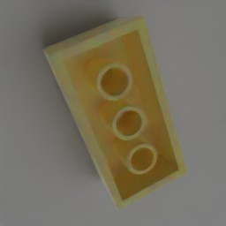
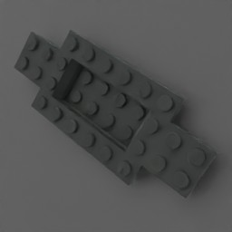

# Lego Renderer

This project automates the rendering of high-quality images for Lego parts, making it easy to generate visuals for cataloging, machine learning, and other applications. Using Blender and an LDraw-based setup, the Lego Renderer produces customizable renders for single or multiple Lego parts.





## Setup Instructions

1. **Clone the Repository**
   ```bash
   git clone https://github.com/adrianlariani/projectname.git
   cd projectname

2. Install Blender

    Download and install [Blender 3.6 LTS](https://www.blender.org/download/lts/3-6/).
    Note the path where Blender is installed (e.g., C:\Program Files\Blender Foundation\Blender 3.6\blender.exe).

3. Run Setup Script
    Execute setup.py to configure dependencies

4. Configure the Blender Path and Output Location

   - Open ```render_one_part_main.py``` or ```render_multiple_parts_main.py```.
   - Update the blender argument in the render_one_model and render_many_models functions to match your Blender path:
     ```bash
     blender="C:\\Program Files\\Blender Foundation\\Blender 3.6\\blender.exe"
     ```
   - Set the output_location parameter to specify where the rendered images should be saved. For example:
     ```bash
     output_location=os.path.abspath("C:\\Renders")
     ```

## Rendering Options
### Render a Single Part

To render a single Lego part with specific parameters, modify the function call in ```render_one_part_main.py```:
```bash
render_one_model(
    blender="C:\\Program Files\\Blender Foundation\\Blender 3.7\\blender.exe",
    script="render_part.py",
    model_files=os.path.abspath("complete/ldraw/parts"),
    colors_rgb=os.path.abspath("colors_rgb.csv"),
    ldraw_import=os.path.abspath("importldraw.zip"),
    output_location=os.path.abspath("C://Renders"),
    part_id="3001",  # Specify the Bricklink ID of the part
    color="Blue"  # Specify the color of the brick; see `colors_rgb.csv` for available options
)
```
#### Key Parameters:
- ```part_id```: Set this to the Bricklink ID of the part you want to render. The available parts are listed in confirmed_models.csv
- ```color```: Specify the desired color. The available colors are listed in colors_rgb.csv.

### Render Multiple Parts
To render multiple Lego parts with specific parameters, modify the function call in ```render_multiple_parts_main.py```:
```bash
render_many_models(
    blender="C:\\Program Files\\Blender Foundation\\Blender 3.7\\blender.exe",
    script="render_numerous_parts.py",
    model_files=os.path.abspath("complete/ldraw/parts"),
    colors_rgb=os.path.abspath("colors_rgb.csv"),
    ldraw_import=os.path.abspath("importldraw.zip"),
    output_location=os.path.abspath("C:\\Renders"),
    confirmed_models_csv=os.path.abspath("confirmed_models.csv"),
    start_index=1,  # Start index in `confirmed_models.csv`
    end_index=2,  # End index in `confirmed_models.csv`
    num_renders_each=5  # Number of renders per piece
)
```
#### Key Parameters:
- ```start_index``` and ```end_index```: Define the range of parts in confirmed_models.csv to render.
- ```num_renders_each```: Set the number of renders per piece for the specified range.

## Files and Resources
- ```colors_rgb.csv```: Contains color options for parts. Modify as needed for additional colors.
- ```confirmed_models.csv```: Lists the models to be rendered with specified indexes.
